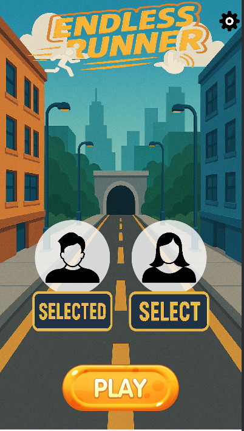
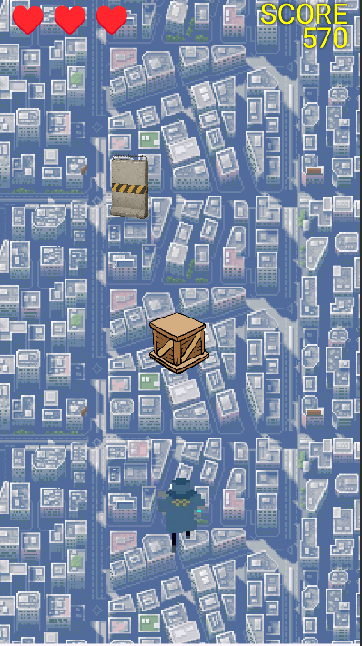
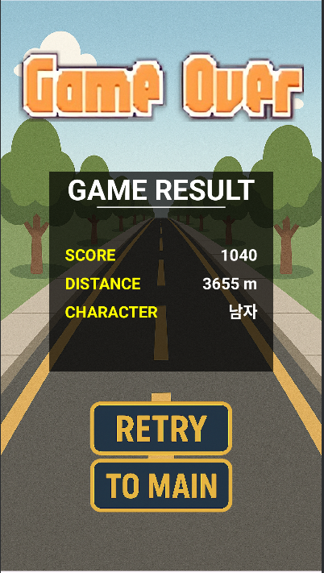
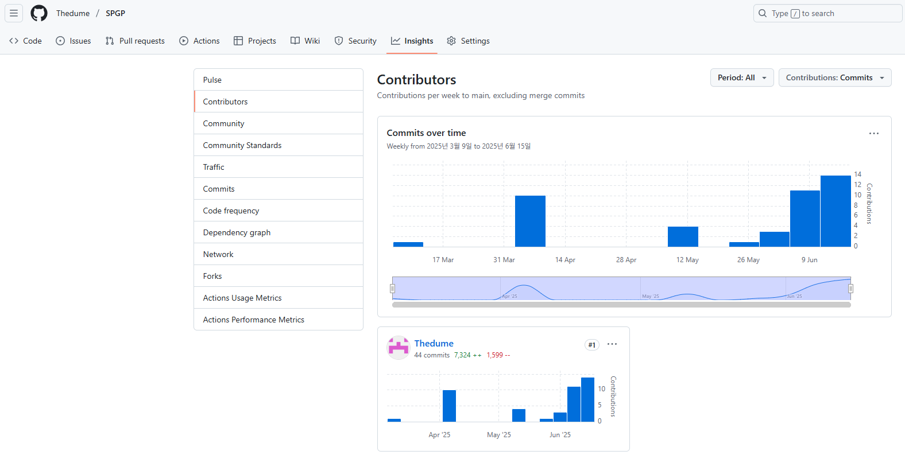

# Endless Runner

## 프로젝트 제목
**Endless Runner**

## 게임 컨셉
- **High Concept**:  
  - 플레이어는 끊임없이 앞으로 달리는 캐릭터를 조작하여 장애물을 피하고 가능한 한 오래 살아남는 것을 목표로 한다.
  - 참고한 게임은 Subway Sufers 게임이며, 해당 게임에는 플레이어가 장애물 위로 올라가는 기능, 아이템이 있으나, 해당 게임에는 존재하지 않는다.

- **핵심 메카닉**:
  - 자동 전진 캐릭터
  - 위/아래/양 옆 스와이프 제스처를 통해 점프 및 슬라이드 동작 수행
  - 장애물과 충돌 시 목숨 1개 감소, 총 3개의 목숨 보유
  - 장애물은 랜덤하게 배치되되, 연속적으로 나오지 않도록 조정
    - 일반 장애물 : 플레이어가 점프로 피할 수 있다.
    - 벽 장애물 : 플레이어가 점프로 피할 수 없다.
  - 점수는 시간, 이동 거리 기반으로 상승 (자세한 내용은 사용된 기술에서 설명)
  - 캐릭터는 남자/여자 중 선택
    - 남자 캐릭터 : 이동속도 10% 증가, 무적 시간 30% 증가
    - 여자 캐릭터 : 충돌 판정 20% 감소,초기 생명력 1개 추가
  - 게임 종료 시 플레이 시간, 이동 거리, 캐릭터 종류(남/여)를 요약해서 보여줌
  - 최고 기록은 5개까지 저장 및 출력

## 게임 실행 흐름
1. 타이틀 화면  
   ㄴ 캐릭터 선택 후 게임 시작  
2. 게임 플레이  
   ㄴ 스와이프 조작으로 장애물 회피, 점수 증가  
   ㄴ 목숨이 0이 되면 게임 종료  
3. 게임 종료 화면  
   ㄴ 플레이 시간, 이동 거리, 캐릭터 종류 표시  
   ㄴ 타이틀 화면으로 복귀

## 개발 범위

| 항목 | 설명 |
|--------|--------|
| View 구현 | CustomView 기반 게임 화면, 타이틀 화면 및 종료 화면 |
| UI 이벤트 | TouchEvent 처리 (스와이프 제스처 인식), 버튼 입력 |
| 캐릭터 동작 | 점프/슬라이드 애니메이션, 이동 |
| 장애물 시스템 | 랜덤 장애물 생성, 충돌 감지, GameObject 관리 |
| 점수 및 상태 | 시간 기반 점수 계산, 목숨 관리, 종료 조건 처리 |
| 기록 저장 | SharedPreferences 를 이용한 상위 5개 점수 저장 및 표시 |
| 리소스 | 캐릭터 이미지 2종, 장애물 이미지, 배경 이미지, 효과음 |
| 프레임워크 | 이번 학기 제공된 CustomView 기반 게임 루프 및 GameObject 구조 사용 |

## 게임 화면






## 📆 개발 일정 (8주간)

| 주차 | 기간 | 개발 내용 | 진행률 | 비고 |
|------|------|-----------|-----|-----------|
| 1주차 | 4/8 ~ 4/14 | 아이디어 확정, 리소스 수집, GitHub 세팅, 화면 설계 | 100% | 
| 2주차 | 4/15 ~ 4/21 | 타이틀 화면 구현, 캐릭터 선택 기능 추가 | 100% | 
| 3주차 | 4/22 ~ 4/28 | 게임 루프, CustomView, 스와이프 점프/슬라이드 구현 | 100% | 
| 4주차 | 4/29 ~ 5/5  | 장애물 랜덤 생성, 연속 방지 로직, 충돌 감지 | 100% | 
| 5주차 | 5/6 ~ 5/12  | 목숨 시스템 구현, 게임 오버 처리 | 100% | 
| 6주차 | 5/13 ~ 5/19 | 점수 계산, 기록 저장 기능 (SharedPreferences) | 100%
| 7주차 | 5/20 ~ 5/26 | 전체 흐름 통합, UI 개선, 애니메이션 적용 | 100%
| 8주차 | 5/27 ~ 6/2  | 테스트, 버그 수정, 최종 README.md 정리 및 제출 | 100%

---

##  Git Commit 활동 (GitHub Insights 기반)


---

##  목표 변경 사항
1. 1차 계획에서는 `activity_main.xml`을 통한 캐릭터 선택 화면을 사용할 예정이었으나,
  **게임 루프에 통합된 TitleScene으로 UI를 옮기는 방식으로 변경**
   - 이유 : 게임이 끝나고, TitleScene으로 변경하는 작업이 있는데, 이를 수행하기 위해선 TitleScene을 따로 만들어 관리하는게 편할 거 같다 판단하였습니다.

2. 1차 계획에서는 가로 게임으로 기획했으나, 구현하면서 **세로 게임으로 수정**
   - 이유 : 게임을 구현하다 보니, 가로로 게임을 제작할 시 플레이어 입장에서 너무 많은 움직임 컨트롤(좌/우 이동 시 끝과 끝으로 이동할 때 수 많은 스와이프 요구..)을 요구해야할 것 같아 세로로 구현했습니다.

3. 점수 측정에서 시간적 요소만 넣었으나, 거리별 가중치를 추가함.
   - 이유 : 플레이어 캐릭터의 종류(스탯)을 나누는 과정에서 이동속도를 넣었고, 이동속도를 바꾼다 한들 점수에 영향이 없어서 점수에 영향을 주도록 하고 싶었습니다.

---

##  MainScene의 주요 GameObject 구조 및 상호작용
### 전체 구조
```
GameActivity (앱 진입점)
 └── TitleScene       (타이틀 / 캐릭터 선택 및 시작)
      └── MainScene   (실제 게임 진행)
           ├── Player (남/여 캐릭터: 이동, 점프, 슬라이드, 충돌, 생명 관리)
           ├── ObstacleSpawner (장애물 생성 관리)
           │     └── Obstacle (장애물: 이동 및 충돌 대상)
           ├── PauseScene (게임 일시정지 처리)
           ├── GameOverScene (게임 종료 후 결과 요약 및 선택지)
           └── ScoreManager 등 기타 UI 요소

```

---

### TitleScene.java
- 역할: 캐릭터 선택 및 게임 시작 화면
- 주요 기능:
  - 남자/여자 캐릭터 선택 버튼 제공
  - "게임 시작" 버튼 클릭 시 MainScene으로 전환

| 항목           | 내용                                                |
| ------------ | ------------------------------------------------- |
| **사용된 기술**   | View 전환, 터치 이벤트 처리, 상태 저장 (static 변수)             |
| **참고한 것들**   | 게임 타이틀 UI 구성 방식 (Subway Surfers, Jetpack Joyride) |
| **수업내용 차용**  | Scene 구조 설계 (`Scene`, `IGameObject`)              |
| **직접 개발한 것** | 캐릭터 선택 로직 및 Start 버튼 구현, `SelectedPlayer` 클래스 설계, 관리자 비밀번호를 통한 점수 초기화 기능  |

```
# 점수 초기화 버튼에 사용되는 함수

private void showPasswordDialog() {
    AlertDialog.Builder builder = new AlertDialog.Builder(GameView.view.getContext());
    builder.setTitle("관리자 모드");
    EditText input = new EditText(GameView.view.getContext());
    builder.setView(input);
    builder.setPositiveButton("확인", (dialog, which) -> {
        String password = input.getText().toString();
        if (ADMIN_PASSWORD.equals(password)) {
            Toast.makeText(GameView.view.getContext(), "인증 성공", Toast.LENGTH_SHORT).show();
            // 관리자 기능 추가 가능
        } else {
            Toast.makeText(GameView.view.getContext(), "비밀번호가 틀렸습니다", Toast.LENGTH_SHORT).show();
        }
    });
    builder.setNegativeButton("취소", null);
    builder.show();
}
```

---


###  MainScene.java
- 역할: 게임 플레이의 핵심 로직 제어
- 주요 기능:
  - Player 객체 생성 및 제스처 이벤트 처리
  - ObstacleSpawner를 통해 장애물 주기적 생성
  - 충돌 판단 및 생명력 감소, UI 반영
  - 점수는 시간 및 이동 거리 기반으로 계산
  - PauseScene과 GameOverScene 전환 처리

| 항목           | 내용                                                   |
| ------------ | ---------------------------------------------------- |
| **사용된 기술**   | 커스텀 게임 루프, 타이머 기반 장애물 생성, HUD 표시, 상태 전이              |
| **참고한 것들**   | Subway Surfers 게임 흐름 구조 (스와이프 기반 진행형 러너)             |
| **수업내용 차용**  | `GameView`, `Scene`, `GameObject` 구조, 타임스탬프 기반 게임 진행 |
| **직접 개발한 것** | 게임 시작/종료 제어 로직, 점수 측정 로직, 체력/점수 UI 표시 |

```
# 스와이프 터치 입력 처리 (피드백 반영 : 터치를 유지하고 있어도 스와이프되도록(캐릭터가))

@Override
public boolean onTouchEvent(MotionEvent event) {
    float[] pts = Metrics.fromScreen(event.getX(), event.getY());
    switch (event.getAction()) {
        case MotionEvent.ACTION_DOWN:
            startX = pts[0];
            startY = pts[1];
            return true;
        case MotionEvent.ACTION_UP:
            float dx = pts[0] - startX;
            float dy = pts[1] - startY;
            if (Math.abs(dx) > Math.abs(dy) && Math.abs(dx) > SWIPE_THRESHOLD) {
                if (dx < 0) player.moveLeft();
                else player.moveRight();
            } else if (Math.abs(dy) > SWIPE_THRESHOLD) {
                if (dy < 0) player.jump();
                else player.slide();
            }
            return true;
    }
    return false;
}
```

```
# 점수 처리 로직

1. 기본 점수
- 초당 10점 획득 (기본 100점의 1/10)
- 0.1초마다 점수 업데이트 (SCORE_UPDATE_INTERVAL = 0.1f)

2. 거리 가중치
- 이동 거리(m) × 0.5 × 0.1초 = 추가 점수
- 예시: 100m 이동 시 5점 추가

3. 보너스 구간
- 1000m마다 보너스 구간 시작
- 보너스 구간에서는 모든 점수가 2배로 증가
- 보너스 구간 진입 시 효과음 재생

4. 최종 점수 계산식
- 예시 계산
  - 일반 구간 (1000m 미만)
  - 기본 점수: 10점/초
  - 거리 보너스: 0.5점/m
  - 최종: (10 + 0.5) ÷ 10 = 1.05점/초
  - 보너스 구간 (1000m 이상)
  - 기본 점수: 10점/초
  - 거리 보너스: 0.5점/m
  - 보너스 배율: 2배
  - 최종: (10 + 0.5) × 2 ÷ 10 = 2.1점/초
```

---

### Player.java / Male, FemalePlayer.java
- 역할: 플레이어 캐릭터의 이동 및 상태 처리
- 차이점:
  - MalePlayer: 이동 속도 10% 증가, 무적 시간 30% 증가
  - FemalePlayer: 충돌 판정 20% 감소, 초기 생명력 1 증가
- 공통 기능:
  - 스와이프 입력 처리 (점프, 슬라이드, 좌/우 이동)
  - 상태 전이 (RUN, JUMP, SLIDE), 애니메이션 처리
  - 충돌 시 생명력 감소 및 무적 시간 적용
  - 부드러운 위치 이동 (targetX, targetY 활용)
  - 상호작용:
    - 장애물(Obstacle)과 충돌 시 목숨 감소 및 1.5초간 무적 시간
    - 터치 입력에 따라 스와이프 동작 처리

| 항목           | 내용                                                  |
| ------------ | --------------------------------------------------- |
| **사용된 기술**   | `SheetSprite`를 이용한 애니메이션 처리, 터치 제스처 분석              |
| **참고한 것들**   | Subway Surfers의 캐릭터 제어 방식 (JUMP/SLIDE 등)            |
| **수업내용 차용**  | `update()`, `draw()` 오버라이드 방식, Sprite 이동 방식         |
| **직접 개발한 것** | 남/여 캐릭터 능력치 설계, 부드러운 이동 구현 (targetX/Y), 무적 시간 처리 로직 |

```
# 플레이어 위치 세팅

protected void initPosition() {
    float centerY = GameConfig.Game.PLAYER_Y_POSITION;
    this.originalY = centerY;

    float laneOffset = GameConfig.Game.LANE_OFFSET;
    laneX[0] = Metrics.width / 2 - laneOffset;
    laneX[1] = Metrics.width / 2;
    laneX[2] = Metrics.width / 2 + laneOffset;

    setPosition(laneX[currentLane], originalY, getSpriteWidth(), getSpriteHeight());
    this.y = originalY;
}

# 레인 중심 좌표(laneX)를 계산해 초기 위치를 설정
# 가로 스와이프 시 moveLeft(), moveRight()에서 currentLane을 조절하며 이동

```

```
# 점프와 슬라이드

public void jump() {
    if (targetY != null) return;
    state = State.JUMP;
    targetY = originalY - OFFSET;
}

public void slide() {
    if (state == State.SLIDE || targetY != null) return;
    state = State.SLIDE;
    targetY = originalY + OFFSET;
}

```

---

### GameOverScene.java
- 역할 : 게임 종료 시 표시되는 화면
- 주요 기능 :
   - 점수, 이동 거리, 캐릭터 종류 표시
   - 최고 기록(5개) 저장 및 업데이트
   - Retry / To Title 버튼 제공

| 항목           | 내용                                              |
| ------------ | ----------------------------------------------- |
| **사용된 기술**   | 점수 요약 출력, SharedPreferences 저장                  |
| **참고한 것들**   | 모바일 게임의 게임 오버 UI 구성 예시                          |
| **수업내용 차용**  | Scene 전환 구조, Button 이벤트 처리                      |
| **직접 개발한 것** | 최고 기록 5개 관리, 점수/거리/캐릭터 종합 출력, Retry/Title 버튼 연동 |

```
# 점수 저장 로직

SharedPreferences prefs = GameView.view.getContext().getSharedPreferences("score", Context.MODE_PRIVATE);
String scoresStr = prefs.getString("records", "");
ArrayList<Integer> scores = new ArrayList<>();

if (!scoresStr.isEmpty()) {
    for (String s : scoresStr.split(",")) {
        scores.add(Integer.parseInt(s));
    }
}
scores.add(score);
Collections.sort(scores, Collections.reverseOrder());
if (scores.size() > 5) {
    scores = new ArrayList<>(scores.subList(0, 5));
}
prefs.edit().putString("records", TextUtils.join(",", scores)).apply();

# 점수를 문자열로 저장
# 기존 점수와 합쳐 내림차순 정렬 후 상위 5개만 유지

```

---

### ObstacleSpawner.java
- 역할: 장애물의 주기적 생성 관리
- 주요 기능:
  - 특정 시간 간격마다 Obstacle 객체 생성
  - 직전 장애물 타입을 고려하여 연속되지 않도록 조절
  - 장애물 타입: 일반 장애물(점프로 회피 가능), 벽 장애물(슬라이드로만 회피 가능)

###  Obstacle.java
- 역할: 장애물 객체의 이동 및 충돌 처리
- 구성:
  - 프레임마다 y축 이동 처리 (이동할 때, 원근감을 위해 점점 커지게 설정)
  - Sprite 상속, 일정 속도로 아래로 이동
  - 화면 밖으로 나가면 자동 제거
- 상호작용:
  - Player와 충돌하면 Player의 목숨 차감 및 본인 제거

```
# 위치 및 크기 업데이트 (Obstacle.java)

@Override
public void update() {
    float dy = SPEED * GameView.frameTime;
    y += dy;

    float t = (y - startY) / (endY - startY);
    t = Math.min(Math.max(t, 0f), 1f);

    float scale = startScale + (endScale - startScale) * t;
    float size = 150f * scale;

    x = startX + (endX - startX) * t;

    if (type == Type.WALL) {
        setSize(size, size * 1.5f);  // 벽은 세로로 더 큼
    } else {
        setSize(size, size);
    }

    if (y - height / 2 > Metrics.height) {
        Scene.top().remove(MainScene.Layer.obstacle, this);  // 화면 아래로 나가면 삭제
    }
}

# 프레임마다 y좌표를 SPEED 만큼 증가시켜 하강
# 위치(t)에 따라 크기를 점차 확대하여 원근감 부여
# 벽(WALL) 타입은 더 큰 세로 길이를 가짐
# 화면 아래로 벗어나면 Scene에서 제거

```

```
# 장애물 업데이트 루프(ObstacleSpawner.java)

public void update() {
    obstacleTimer += GameView.frameTime;
    if (obstacleTimer >= spawnInterval && obstacleQueue.isEmpty()) {
        obstacleTimer = 0f;
        scheduleObstacleGroup();
        spawnDelayTimer = 0f;
    }

    if (!obstacleQueue.isEmpty()) {
        spawnDelayTimer += GameView.frameTime;
        if (spawnDelayTimer >= spawnDelay) {
            spawnDelayTimer = 0f;
            spawnNextObstacle();
        }
    }
}

# 일정 주기마다 scheduleObstacleGroup() 호출 → 장애물 위치 예약
# 예약된 장애물들은 딜레이를 두고 spawnNextObstacle()로 생성됨

private void scheduleObstacleGroup() {
    int[] lanes = {0, 1, 2};
    shuffleArray(lanes);
    int count = GameConfig.Obstacle.MIN_OBSTACLES_PER_GROUP + 
               (int)(Math.random() * (GameConfig.Obstacle.MAX_OBSTACLES_PER_GROUP - 
                                    GameConfig.Obstacle.MIN_OBSTACLES_PER_GROUP + 1));
    for (int i = 0; i < count; i++) {
        obstacleQueue.add(lanes[i]);
    }
}

# 레인을 랜덤으로 셔플
# 1~3개 사이의 장애물을 무작위 레인에 배치 예약

private void spawnNextObstacle() {
    int lane = obstacleQueue.poll();
    float x = player.getLaneX(lane);
    float yOffset = (float)(Math.random() * 100f);

    Obstacle.Type type = Math.random() < GameConfig.Obstacle.WALL_SPAWN_CHANCE ? 
                       Obstacle.Type.WALL : Obstacle.Type.NORMAL;
    int resId = (type == Obstacle.Type.WALL) ? R.mipmap.obstacle_wall : R.mipmap.obstacle_box;
    Obstacle obs = new Obstacle(resId, x, yOffset, type);
    scene.add(obstacleLayer, obs);
}

# 예약된 레인 정보를 꺼내 해당 위치에 장애물 생성

```

---

### PauseScene.java
- 역할: 일시정지 상태 화면
- 주요 기능:
  - Resume 버튼: 게임 복귀
  - Exit 버튼: 타이틀 화면으로 이동

| 항목           | 내용                                                      |
| ------------ | ------------------------------------------------------- |
| **사용된 기술**   | 일시정지 상태 구현, Resume/Exit 버튼                              |
| **참고한 것들**   | 게임의 Pause 메뉴 구성 및 동작 (Jetpack Joyride 참고)               |
| **수업내용 차용**  | 전체적인 코드 차용                         |
| **직접 개발한 것** | 버튼 구성 |


---

##  아쉬웠던 점
- 리소스들을 직접 만들 수 없다는 점에 여러 애니메이션이라던가, 자료 조사 시간이 길어져 이런 저런 개발 기간이 딜레이가 있었다는 점이 아쉬웠습니다.
- 아이템 기능을 넣어보고 싶었으나, 기획 및 리소스 수집 등에 문제로 만들지 못한게 아쉬웠습니다.

## 팔기 위해 보충할 것들
- 다른 플레이어와의 점수로 경쟁 요소
- 플레이할 수 있는 기회 무한대가 아닌 횟수 제한(ex. 5분에 한번씩 차는 플레이 기회를 사용)
- 처음 플레이하는 유저를 위한 튜토리얼 기능

## 어려웠던 점
- 스와이프 제스처를 4방향으로 정확히 감지하는 것이 까다로웠습니다.
- Player 점프/슬라이드 상태 복귀 로직 타이밍 조절이 까다로웠습니다.
- Scene 구조가 명확히 잡혀서 이후 UI/상태 확장은 쉬웠지만, 초반 구조 설정이 어려웠습니다.

## 수업에 대한 소감
- 실제 스마트폰 게임을 처음부터 끝까지 완성해보는 경험을 기대한 수업이었고, 해당 목표에 도달한 과정이 정말 재밌게 느껴졌습니다.
- 더 좋은 수업을 위한 제안으로는, 첫 팀프로젝트 기획단계에서 그동안 윗학년들은 어떠한 기획을 했고, 잘 했는지, 못 했는지와 같은 결과물을 예시로 몇 개 설명해주신다면, 프로젝트에 관해 더 쉽게 생각해볼 수 있지 않을까 라는 생각이 있습니다.

---

## 음원 출처

- 기본 배경음악
- ✔ Music provided by 셀바이뮤직
- 🎵 Title : 해변의 저녁 by SellBuyMusic
- https://sellbuymusic.com/md/mqitchw-lottftw

- 플레이어 점프 소리
- ✔ SFX provided by 셀바이뮤직
- https://sellbuymusic.com/md/svuvqtk-rrttftw

- 플레이어 충돌 소리
- ✔ SFX provided by 셀바이뮤직
- https://sellbuymusic.com/md/souldfh-elttftw

- 버튼 터치 소리
- ✔ SFX provided by 셀바이뮤직
- https://sellbuymusic.com/md/siugcbb-jqttftw 
