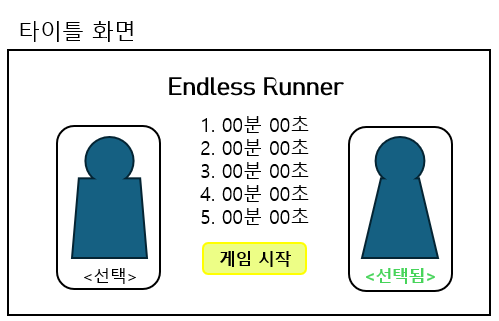
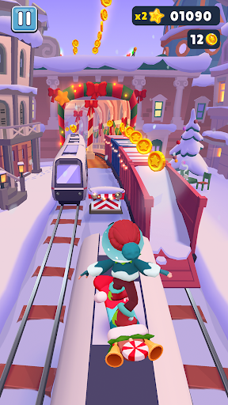
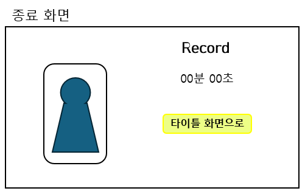

# Endless Runner

## 프로젝트 제목
**Endless Runner**

## 게임 컨셉
- **High Concept**:  
  플레이어는 끊임없이 앞으로 달리는 캐릭터를 조작하여 장애물을 피하고 가능한 한 오래 살아남는 것을 목표로 한다.

- **핵심 메카닉**:
  - 자동 전진 캐릭터
  - 위/아래 스와이프 제스처를 통해 점프 및 슬라이드 동작 수행
  - 장애물과 충돌 시 목숨 1개 감소, 총 3개의 목숨 보유
  - 장애물은 랜덤하게 배치되되, 연속적으로 나오지 않도록 조정
  - 점수는 시간 기반으로 상승
  - 캐릭터는 남자/여자 중 선택
  - 게임 종료 시 플레이 시간, 이동 거리, 캐릭터 종류를 요약해서 보여줌
  - 최고 기록은 5개까지 저장 및 출력

## 개발 범위

| 항목 | 설명 |
|--------|--------|
| View 구현 | CustomView 기반 게임 화면, 타이틀 화면 및 종료 화면 |
| UI 이벤트 | TouchEvent 처리 (스와이프 제스처 인식), 버튼 입력 |
| 캐릭터 동작 | 점프/슬라이드 애니메이션, 이동 |
| 장애물 시스템 | 랜덤 장애물 생성, 충돌 감지, GameObject 관리 |
| 점수 및 상태 | 시간 기반 점수 계산, 목숨 관리, 종료 조건 처리 |
| 기록 저장 | SharedPreferences 를 이용한 상위 5개 점수 저장 및 표시 |
| 리소스 | 캐릭터 이미지 2종, 장애물 이미지, 배경 이미지, 효과음 |
| 프레임워크 | 이번 학기 제공된 CustomView 기반 게임 루프 및 GameObject 구조 사용 |

## 예상 게임 실행 흐름
1. 타이틀 화면  
   ㄴ 캐릭터 선택 후 게임 시작  
2. 게임 플레이  
   ㄴ 스와이프 조작으로 장애물 회피, 점수 증가  
   ㄴ 목숨이 0이 되면 게임 종료  
3. 게임 종료 화면  
   ㄴ 플레이 시간, 이동 거리, 캐릭터 표시  
   ㄴ 타이틀 화면으로 복귀

## 예상 게임 화면

#### 예상 인게임 화면(ex. SUBWAY SURFERS)

## 📆 개발 일정 (8주간)

| 주차 | 기간 | 개발 내용 |
|------|------|-----------|
| 1주차 | 4/8 ~ 4/14 | 아이디어 확정, 리소스 수집, GitHub 세팅, 화면 설계 |
| 2주차 | 4/15 ~ 4/21 | 타이틀 화면 구현, 캐릭터 선택 기능 추가 |
| 3주차 | 4/22 ~ 4/28 | 게임 루프, CustomView, 스와이프 점프/슬라이드 구현 |
| 4주차 | 4/29 ~ 5/5  | 장애물 랜덤 생성, 연속 방지 로직, 충돌 감지 |
| 5주차 | 5/6 ~ 5/12  | 목숨 시스템 구현, 게임 오버 처리 |
| 6주차 | 5/13 ~ 5/19 | 점수 계산, 기록 저장 기능 (SharedPreferences) |
| 7주차 | 5/20 ~ 5/26 | 전체 흐름 통합, UI 개선, 애니메이션 적용 |
| 8주차 | 5/27 ~ 6/2  | 테스트, 버그 수정, 최종 README.md 정리 및 제출 |

---
